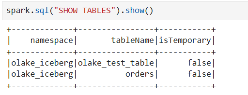
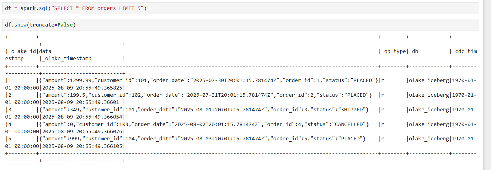
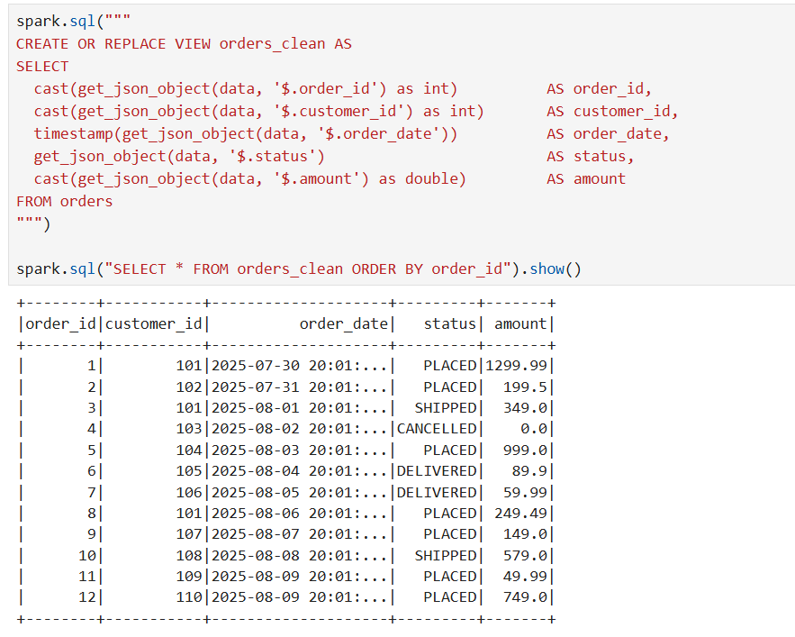

# Data Engineering Pipeline – PostgreSQL → OLake → Apache Iceberg → Spark

## Overview
This project demonstrates a local data engineering workflow that:
1. **Extracts** data from PostgreSQL.  
2. **Loads** it into Apache Iceberg format using **OLake**.  
3. **Stores** Iceberg tables in an **S3-compatible MinIO warehouse**.  
4. **Queries** the data through **Iceberg REST Catalog** using **Apache Spark**.

---

## Architecture
```
PostgreSQL → OLake Source Connector → Iceberg REST Catalog (MinIO backend) → Spark SQL
```

---

## Setup Steps

### 1. Clone the Repository
```bash
git clone https://github.com/consolebuddy/datazip-assignment.git
cd datazip_assignment
```

---

### 2. Start Services
We use Docker Compose to spin up:
- **PostgreSQL** (source DB)  
- **MinIO** (S3-compatible object storage)  
- **Iceberg REST Catalog** (metadata API)

```bash
docker compose up -d
```

---

### 3. Check the orders table
```bash
docker exec -it pg_src psql -U olake -d source -c "SELECT count(*) FROM orders;"
```


### 4. OLake discover & sync
```bash
docker run --pull=always -v "$PWD/olake:/mnt/config" olakego/source-postgres:latest discover --config /mnt/config/source.json
docker run --pull=always --network datazip_assignment_default -v "$PWD/olake:/mnt/config" olakego/source-postgres:latest sync --config /mnt/config/source.json --catalog /mnt/config/streams.json --destination /mnt/config/destination.json
```

### 5. list all namespaces, olake_iceberg namespace, tables in that namespace
```bash
docker run --rm --network datazip_assignment_default curlimages/curl -s http://iceberg-rest:8181/v1/namespaces
docker run --rm --network datazip_assignment_default curlimages/curl -s http://iceberg-rest:8181/v1/namespaces/olake_iceberg
docker run --rm --network datazip_assignment_default curlimages/curl -s http://iceberg-rest:8181/v1/namespaces/olake_iceberg/tables
```

---

### 6. Query with Spark SQL (via your spark-iceberg container)
```bash
docker exec -it spark-iceberg spark-sql --conf spark.sql.catalog.rest=org.apache.iceberg.spark.SparkCatalog --conf spark.sql.catalog.rest.catalog-impl=org.apache.iceberg.rest.RESTCatalog --conf spark.sql.catalog.rest.uri=http://iceberg-rest:8181 --conf spark.sql.catalog.rest.io-impl=org.apache.iceberg.aws.s3.S3FileIO --conf spark.sql.catalog.rest.warehouse=s3://warehouse/ --conf spark.sql.catalog.rest.s3.endpoint=http://minio:9000 --conf spark.sql.catalog.rest.s3.path-style-access=true --conf spark.sql.catalog.rest.s3.region=us-east-1 --conf spark.sql.catalog.rest.aws.region=us-east-1
```

### 7. Inside the shell
```bash
USE rest.olake_iceberg;
SHOW TABLES;
SELECT * FROM orders LIMIT 20;
```


### 8. Jupyter (Spark UI)
Open http://localhost:8888 → New → Notebook → Python 3

```bash
from pyspark.sql import SparkSession

spark = (
    SparkSession.builder
    .appName("IcebergQuery")
    .config("spark.sql.catalog.local", "org.apache.iceberg.spark.SparkCatalog")
    .config("spark.sql.catalog.local.type", "rest")
    .config("spark.sql.catalog.local.uri", "http://iceberg-rest:8181")
    .config("spark.sql.catalog.local.io-impl", "org.apache.iceberg.aws.s3.S3FileIO")
    .config("spark.sql.catalog.local.warehouse", "s3://warehouse/")
    .config("spark.sql.catalog.local.s3.endpoint", "http://minio:9000")
    .config("spark.sql.catalog.local.s3.path-style-access", "true")
    .config("spark.sql.catalog.local.s3.access-key-id", "admin")
    .config("spark.sql.catalog.local.s3.secret-access-key", "password")
    .getOrCreate()
)

df = spark.sql("SELECT * FROM local.olake_iceberg.orders")
df.show()
```

---

## Screenshots

**Spark SQL UI Job Execution**




---

## Challenges Faced
- **Incorrect REST API paths** – Initially used `/v1/{catalog}/namespaces` instead of `/v1/namespaces`. Fixed after reading Iceberg REST spec.  
- **AWS Region Mismatch** – Had to set both `AWS_REGION` and `aws.region` in configs to avoid SDK errors.  
- **Schema Discovery** – Forgot to redirect discovery output into `streams.json`, which caused sync failures.

---

## Improvements Suggested 
- Enable **CDC (Change Data Capture)** for real-time updates from Postgres.  
- Add **Grafana dashboard** connected to Iceberg via Trino/Presto for visualization.

---
